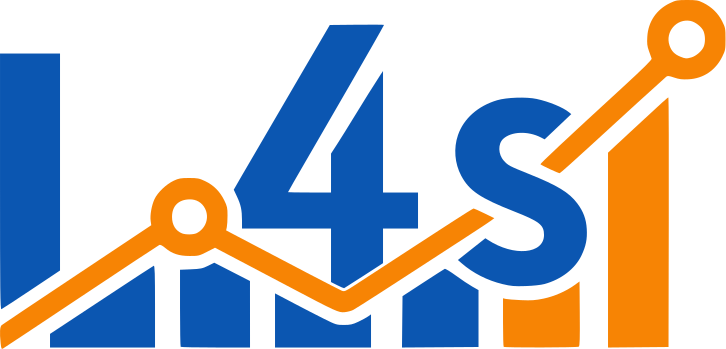

<div align="center">


# LLM4Series
**A library for time series forecasting using Large Language Models**

[](https://pypi.org/project/llm4series/)

[](LICENSE)
[](https://llm4time.github.io/llm4series/)
[](https://www.youtube.com/)
</div>

<p align="center">
  <a href="#get-started">Get Started</a> •
  <a href="https://llm4time.github.io/llm4series/">Documentation</a> •
  <a href="#citation">Citation</a> •
  <a href="#collaborators">Collaborators</a> •
  <a href="#license">License</a>
</p>

## Get Started

llm4series is a Python library for time series forecasting using Large Language Models (LLMs).
It provides a modular architecture that includes:
- Data preprocessing and handling
- Prompt generation
- Forecasting with LLMs
- Metric evaluation
- Interactive visualization

### Installation
```bash
pip install llm4series
```

Or clone the repository and install dependencies:
```bash
git clone https://github.com/llm4time/llm4series.git && \
cd llm4series && \
pip install -e .
```

## Citation

This library was first presented at the **1st Time Series Age with LLMs** workshop, ICLR 2026.

You can read and discuss our paper on [OpenReview](https://openreview.net/forum?id=6fbcYFRoUL).

If you use llm4series in your research, please cite:

```latex
@inproceedings{silva2026llm4series,
  title={LLM4series: Structured prompting for time series forecasting with LLMs},
  author={Silva, Wesley Barbosa and Scarcela, Maria Fernanda Aquino Freitas and Viana, Luiz Zairo Bastos and Caminha, Carlos and do Vale Madeiro, Jo{\~a}o Paulo and da Silva, Jos{\'e} Wellington Franco},
  booktitle={1st ICLR Workshop on Time Series in the Age of Large Models},
  year={2026}
}
```

## Collaborators
<div align="center">
<table>
  <tr>
    <td align="center" nowrap>
      <a href="https://github.com/wesleey"></a>
      <br />
      <sub><b>Wesley Barbosa</b></sub>
      <br />
      <sub><i>Undergraduate student - UFC</i></sub>
      <br />
      <a href="mailto:wesley.barbosa.developer@gmail.com" title="Email">📧</a>
      <a href="https://www.linkedin.com/in/wesleybarbosasilva/" title="LinkedIn">🔗</a>
    </td>
    <td align="center" nowrap>
      <a href="https://github.com/zairobastos"></a>
      <br />
      <sub><b>Zairo Bastos</b></sub>
      <br />
      <sub><i>Master’s student - UFC</i></sub>
      <br />
      <a href="mailto:zairobastos@gmail.com" title="Email">📧</a>
      <a href="https://www.linkedin.com/in/zairobastos/" title="LinkedIn">🔗</a>
    </td>
    <td align="center" nowrap>
      <a href="https://github.com/fernandascarcela"></a>
      <br />
      <sub><b>Fernanda Scarcela</b></sub>
      <br />
      <sub><i>Undergraduate student - UFC</i></sub>
      <br />
      <a href="mailto:fernandascla@alu.ufc.br" title="Email">📧</a>
      <a href="https://www.linkedin.com/in/fernanda-scarcela-a95543220/" title="LinkedIn">🔗</a>
    </td>
    <td align="center" nowrap>
      <a href="https://lattes.cnpq.br/5168415467086883"></a>
      <br />
      <sub><b>José Wellington Franco</b></sub>
      <br />
      <sub><i>Academic advisor - UFC</i></sub>
      <br />
      <a href="mailto:wellington@crateus.ufc.br" title="Email">📧</a>
      <a href="https://lattes.cnpq.br/5168415467086883" title="Lattes">🔗</a>
    </td>
    <td align="center" nowrap>
      <a href="https://lattes.cnpq.br/4380023778677961"></a>
      <br />
      <sub><b>Carlos Caminha</b></sub>
      <br />
      <sub><i>Academic advisor - UFC</i></sub>
      <br />
      <a href="mailto:caminha@ufc.br" title="Email">📧</a>
      <a href="https://lattes.cnpq.br/4380023778677961" title="Lattes">🔗</a>
    </td>
  </tr>
</table>
</div>

## License

This project is licensed under the MIT License. See the [LICENSE](LICENSE) file for details.
